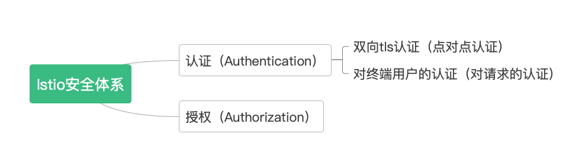

Istio内部实现了认证和授权这两种基本的安全机制。认证的含义是来识别对方是不是一个合法的对象，常用的认证包括使用用户名和密码进行认证、使用证书进行认证等等。而授权则是在认证的基础上来进一步确认对方有没有执行某种操作的权限，例如这个用户只有读取某个对象的权限而没有写入的权限，这时授权系统就会放行用户对这种对象的读操作、也会拒绝这个用户对这种对象的写操作。

Istio中的认证包括两种类型：双向tls(mtls)认证和对终端用户的认证。

双向tls认证是指实际的源pod的Envoy与目的pod的Envoy之间的基于证书的认证，也就是说客户端和服务器端都要对对方的证书进行验证，以便确认对方是可信的、而不是由第三方伪造的。

对终端用户的认证是指对发出请求的主体进行验证，验证的对象是源Pod而不是源Pod对应的Envoy Proxy，也被称为对请求的认证，即request authentication。
